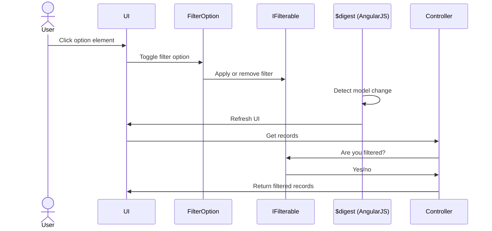

# AngularJS Filtering Proof of Concept
Web application to demonstrate how object-oriented programming may be used to provide UI filtering in an AngularJS application.  The application was written to propose a different way of thinking about how courses and course sections may be filtered in CMU's [Course Search & Registration](https://courseregistration.apps.cmich.edu).  That application currently uses if/switch statement in the view controller to perform the filtering.

## Source Code Components
A basic view is provided in `index.html`.  The AngularJS application is written in TypeScript and the source files are contained in the `Scripts/app` folde:

* `app.config.ts` contains the Angular module (application) defintion
* `app.filtering.ts` contains the set of classes that represent the filtering concepts
* `app.mainView.ts` contains the set of classes that drive the view
* `app.models.ts` contains the classes that may be filtered
* `app.testData.ts` provides a mechanism to generate test data

## Premise
Since this demo is based on a real-word example, we're starting with the presumtion that there are records to display on the page and that we want to give the user a way to show or hide some of those records based on criteria.  There is a list of courses and each course contains one or more sections.  We'll want the user to be able to hide records based on a particular attribute.  For example, a user who doesn't want to see graduate courses may de-select the 500+ level option.

The demo works around to main concepts:  filterable records and filters.  A filterable record is an item or hierarchy of items that can be hidden from view.  A filter is a collection of options to present to the user to allow them to hide items.

For a record to be recognized as filterable, it must implement the `IFilterable` interface, which requires it to provide a `FilterState` field.  The `FilterState` is used by the controller to determine whether a record should be returned for display, and is used by one or more `FilterOption` instances to apply or remove a `Filter`.

When a `Filter` is created, it is given a descriptive name and a set of `FilterOption` instances.  Each `FilterOption` is also given a descriptive name, a link to the `Filter` to which it belongs, and an evaluation function.  The evaulation function is of type `OptionCandidateSelector` and is used by the `FilterOption` to determine whether it should be concerned with a particular record.  

The application intends that the set of filters with options will be created initially and that the each filterable record will be presented to each filter option once.  The option will call the evaulation function for each record presented to it and the evaluation function will indicate whether the option applies to that record.  If it does, the option will maintain a link to the record to access its filter state as appropriate.  If it doesn't, the option will disregard the record.  The purpose this design is to avoid the need to evaluate every record when a filter changes, which is how a procedural design would commonly approach the solution.  Instead, the options only need to be concerned with the records to which they apply, and not every record in the data set.

The following diagram illustrates how the components interrelate:

## Assumptions
* Each course has at least one section.  Since students enroll in sections, we'll assume any data errors have been corrected.

## Caveats
* The demo uses a subset of real-world records, and only a few test records are generated, so performance is yet to be seen in a sememester that has hundreds of sections.  Filtering of other types of data on the page may also impact perforamnce.

## Future Enhancements
* The demo only displays filter options as checkboxes.  Extra work would need to be done for it work with `select` elements.
* Since the evaluation function is only executed once, the standard `FilterOption` won't work for cases where we're filtering on user input (e.g. searching a course title).  In those situations, a specialized case of `FilterOption` could be created that would link all records and then perform a lazy evaluation as the input changes.